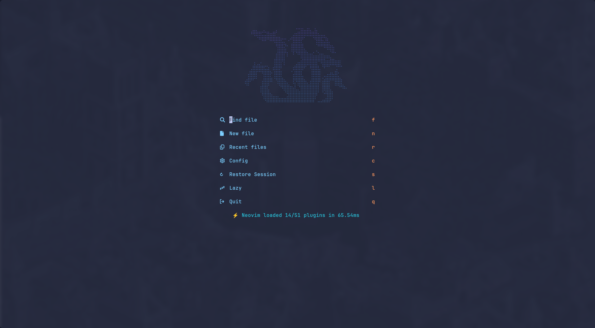

# AlanJS's Neovim config





## Install

You only have to clone this repo in `~/.config/nvim` and then launch neovim

```bash
git clone https://github.com/AlanJs26/nvim_config.git ~/.config/nvim
```

An alternative way is to run the script `install.sh` that does this for you

```bash
sh -c "$(curl -fsSL https://raw.githubusercontent.com/AlanJs26/nvim_config/master/install.sh)"
```

If do not have neovim installed yet, you can append the flag `--nvim-appimage` to setup the latest official neovim appimage globally

```bash
curl -fsSL https://raw.githubusercontent.com/AlanJs26/nvim_config/master/install.sh| bash -s -- --nvim-appimage
```
